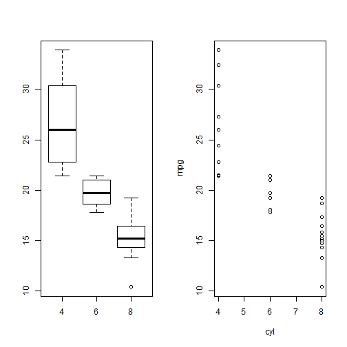

Analysis of the mtcars dataset - Reproducible Pitch Presentation
========================================================
author: Suriyan Raveendiran Rajeswari
date: April 26 2015
transition: rotate

Coursera Data Products Pitch
========================================================

### See the Data Products Course Project  

- URL: *https://suriyanrr.shinyapps.io/Shiny_Week3/*
- Github Repository: *https://github.com/suriyanrr/DataProducts*
- Find all the codes that have been used for this presentation in the above mentioned Github Repository. Also the code for the first part of the data Science Project which was to create a Shiny application is available in the same repository. Rstudio Presenter was used to prepare this pitch presentation.

### Find all details here
URL: *https://class.coursera.org/devdataprod-007*

Source Dataset
========================================================

**A data frame with 32 observations on 11 variables.**

| Index | Field | Detail |
------- | ----- | ------ |
| [, 1] | mpg | Miles/(US) gallon |
| [, 2]  | cyl | Number of cylinders |
| [, 3]  | disp | Displacement (cu.in.) |
| [, 4]	| hp | Gross horsepower |
| [, 5]	| drat | Rear axle ratio |
| [, 6]	| wt | Weight (lb/1000) |
| [, 7]	| qsec | 1/4 mile time |
| [, 8]	| vs | V/S |
| [, 9]	| am | Transmission (0 = automatic, 1 = manual) |
| [,10]	| gear | Number of forward gears |
| [,11]	| carb | Number of carburetors |

Features of the Application
========================================================

- The application is used for understanding the relationship between miles per gallon (MPG) and the other variables in the dataset 
- The relationship can be visualised using a box plot as well as a regression model 
- There is a selector using which the user can select the variable that needs to be used for the comparison 
- Also the user has the flexibility to show the outliers or to hide them in the analysis 
- The outliers check box is applicable only to the box plot and all outliers are always included in the regression model 
- The user can toggle between the box plot and the regression model by clicking on the appropriate tabs

Sample Plots
========================================================


```r
library(datasets); par(mfcol = c(1, 2))
boxplot(mpg~cyl,mtcars);plot(mpg~cyl,mtcars)
```

 

